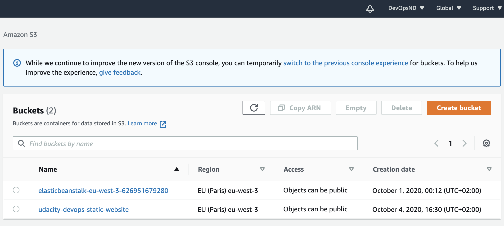
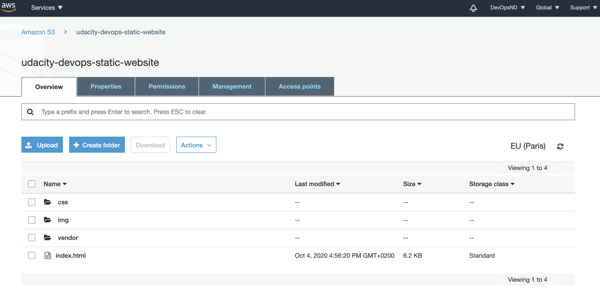
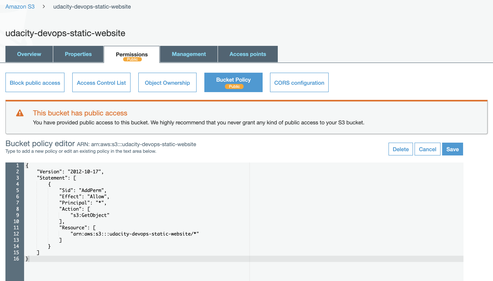
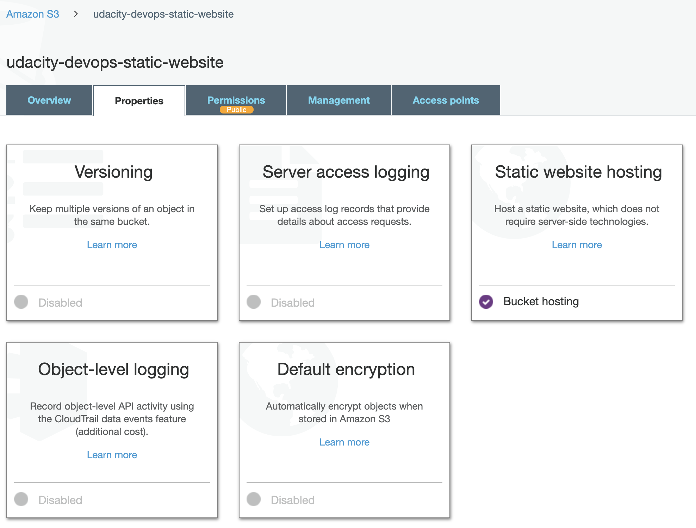
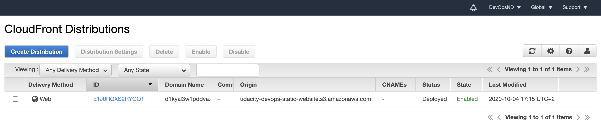
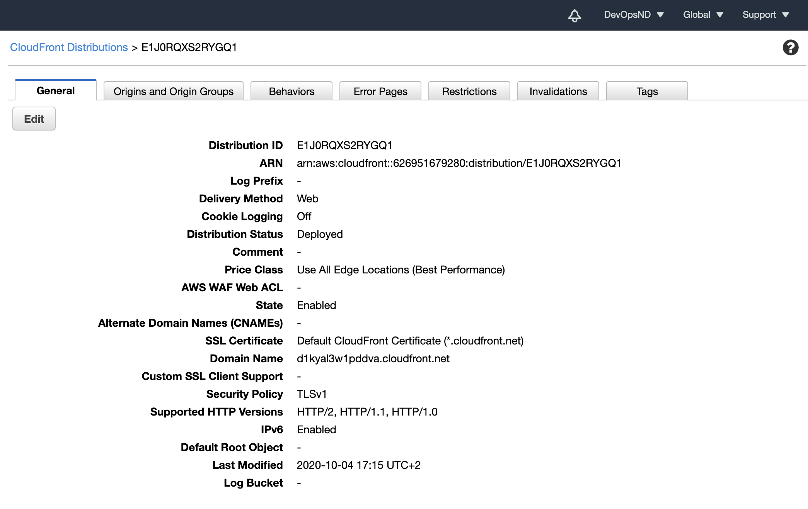
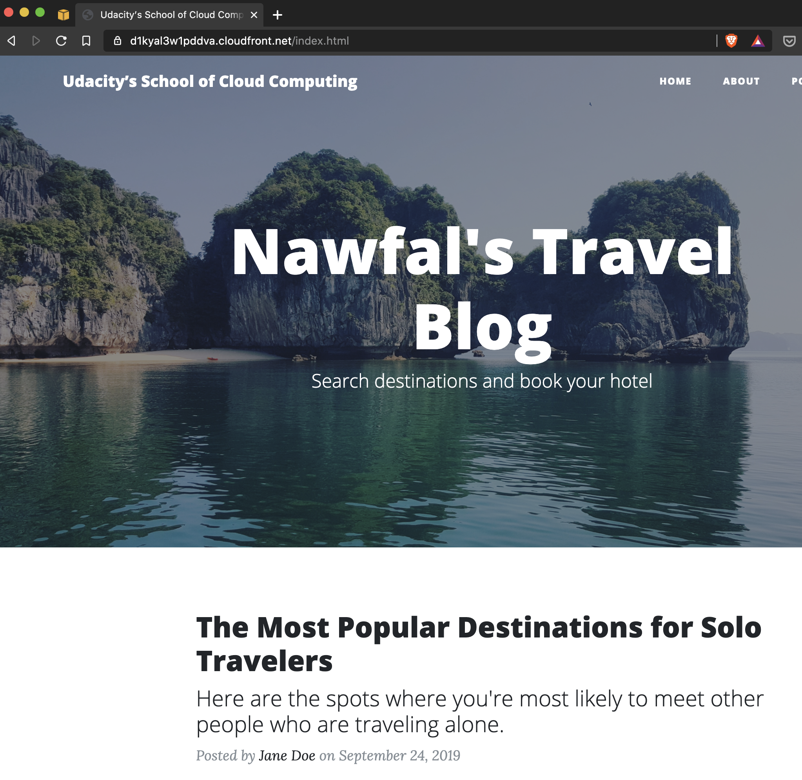

# Project 1: Deploying a Static Website to AWS

## Website Files

1. Created *S3* bucket `udacity-devops-static-website` to host website files.

2. Uploaded website files to the bucket.

3. Added *IAM* policy to make bucket content publicly accessible.

4. Configured bucket to support static website hosting.

## Website Distribution
Configured *CloudFront* to retrieve and distribute website files.

## Web Browser Access
Made website accessible to anyone through a [*CloudFront* endpoint](https://d1kyal3w1pddva.cloudfront.net/index.html).

## Bonus
Customized website name and header image.
