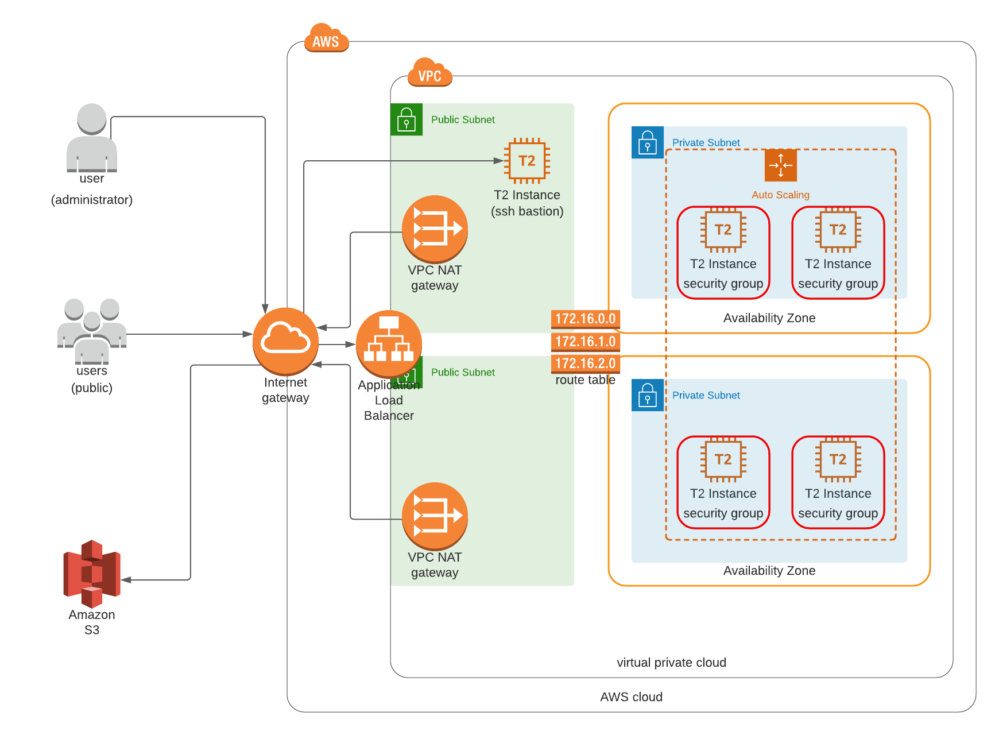

# Project 2: Deploying a High-Availability Web App using CloudFormation

Goal: automatically deploy web application and underlying infrastructure

## [Infrastructure Diagram](https://lucid.app/invitations/accept/537d9b34-1911-4bcf-9a67-1815db6e4ff4)

- The VPC contains 1 *public* subnet and 2 *private* subnets in 2 different *availability zones*.
- Each private subnets contains 2 `t2.medium` servers (2 vCPUs, 4GiB RAM, 10GiB EBS disk).
- The 4 servers are withing an *autoscaling group*, which itself is associated with an *application load balancer*.
- The *application load balancer* distributes user traffic uniformly across the 4 webservers and performs health checks.
- The public subnet contains a `t2.micro` instance that serves as a *SSH bastion host*.
- The *internet gareway* allows the infrastructure to communicate with the internet , both inbound (public HTTP/80 for users, IP-specific SSH/22 for administration) and outbound (S3).
- The *network address translation gateway*, placed in the *public subnet*, allows resources within the *private* subnets to access the internet.
- Each of the 4 web servers is associated with `web` security group, which only allows **inbound HTTP traffic** through **port 80**.
- The bastion host is associated with the `admin` security group, which only allows **inbound SSH traffic** through **port 80** from **the administrator's IP address**. 
- The *routing table* for the *private* subnet allows all traffic withing the the VPC and outbound internet traffic through the NAT *gateway*.

---

## Project Rubric (temporary)

- Deployment basics
  - [ ] Parameters
  - [ ] Resources
  - [ ] Outputs
  - [ ] Check
- Load Balancer
  - [ ] Target Group
  - [ ] Health Check and Listener
- Auto-Scaling
  - [ ] Subnets
  - [ ] Machine Specs
  - [ ] SSH Key
- Bonus
  - [ ] Outputs
  - [ ] Bastion host
